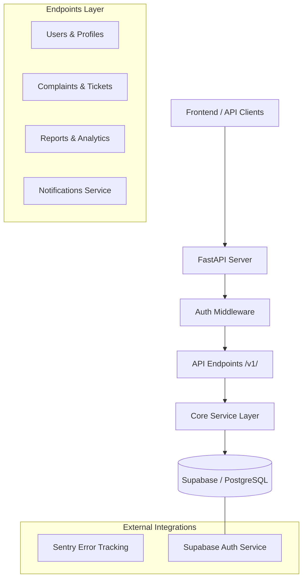

# 🛡 ASTU Smart Complaint & Issue Tracking - Backend

[](https://fastapi.tiangolo.com/)
[](https://www.python.org/)
[](https://supabase.com/)
[](https://www.postgresql.org/)

The robust, high-performance backend for the ASTU Smart Complaint & Issue Tracking system. Powered by FastAPI and Supabase, it handles authentication, data persistence, real-time notifications, and complex business logic.

---

## 🏛 Architecture Overview

The backend follows a **Layered API Architecture** with a focus on speed, scalability, and secure data access.



---

## 🚀 Key Features

### 🔐 Secure Authentication

- **Role-Based Access Control (RBAC)**: Fine-grained permissions for Students, Staff, and Admins.
- **JWT Validation**: Secure token-based authentication session management.
- **Admin Invites**: Specialized flow for admins to invite new staff and students.

### 📋 Complaint Lifecycle

- **Dynamic Routing**: Automatic assignment of complaints based on department categories.
- **SLA Management**: Backend calculation of resolution deadlines (Service Level Agreements).
- **Audit Logging**: Comprehensive tracking of status changes and staff assignments.

### 🔔 Notification Engine

- **Event-Driven Alerts**: Triggering notifications for new messages, status updates, and resolutions.
- **Role-Targeted Messaging**: Smart logic to determine who receives alerts (Student vs assigned Staff).

---

## 🛠 Tech Stack

| Technology       | Purpose                                                                |
| :--------------- | :--------------------------------------------------------------------- |
| **FastAPI**      | Modern, high-performance web framework for building APIs.              |
| **Uvicorn**      | ASGI server for high-concurrency performance.                          |
| **Pydantic**     | Data validation and settings management using Python type annotations. |
| **Supabase SDK** | Seamless integration with PostgreSQL and Auth.                         |
| **Sentry**       | Real-time error monitoring and crash reporting.                        |

---

## 📂 Project Structure

```text
app/
├── api/
│   └── v1/
│       └── endpoints/   # Individual API route handlers
├── core/                # App configuration and global clients (Supabase)
├── models/              # Pydantic schemas for request/response validation
├── dependencies.py      # FastAPI DI for auth and permissions
└── main.py              # Application entry point and middleware config
```

---

## ⚙️ Setup & Installation

### Prerequisites

- Python 3.9+
- Pip and Virtualenv

### Step-by-Step Guide

1. **Navigate to the backend folder**:
   ```bash
   cd Backend
   ```
2. **Create a virtual environment**:
   ```bash
   python -m venv .venv
   source .venv/bin/activate  # On Windows: .venv\Scripts\activate
   ```
3. **Install dependencies**:
   ```bash
   pip install -r requirements.txt
   ```
4. **Environment Variables**:
   Copy `.env.example` to `.env` and fill in your Supabase credentials:
   ```env
   SUPABASE_URL=your_project_url
   SUPABASE_SERVICE_ROLE_KEY=your_service_role_key
   FRONTEND_URL=http://localhost:5173
   ```
5. **Run the server**:
   ```bash
   uvicorn app.main:app --reload
   ```

---

## 🛣 API Documentation

Once the server is running, you can access the interactive documentation at:

- **Swagger UI**: [http://localhost:8000/docs](http://localhost:8000/docs)
- **Redoc**: [http://localhost:8000/redoc](http://localhost:8000/redoc)

---

_Developed for the ASTU Smart Complaint & Issue Tracking system._
